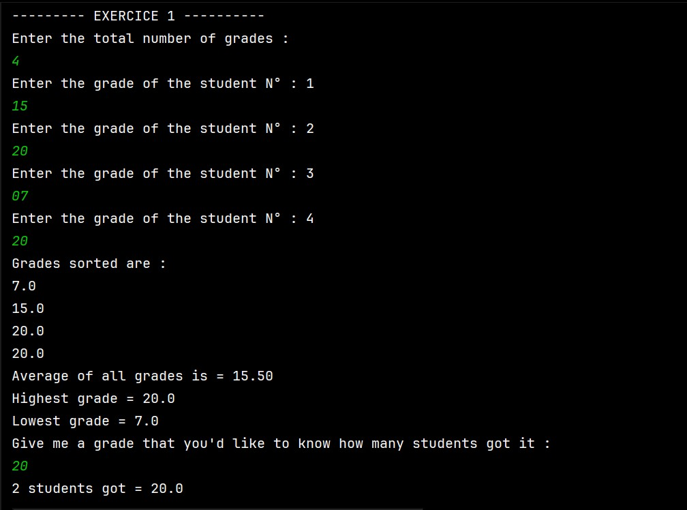
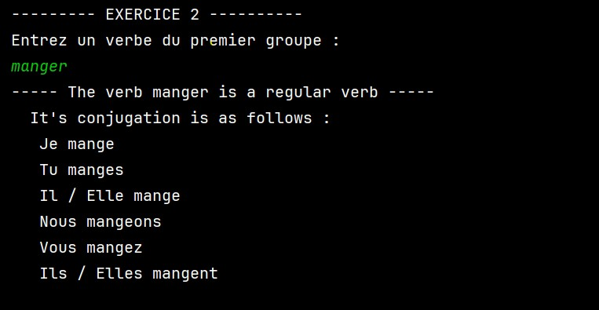
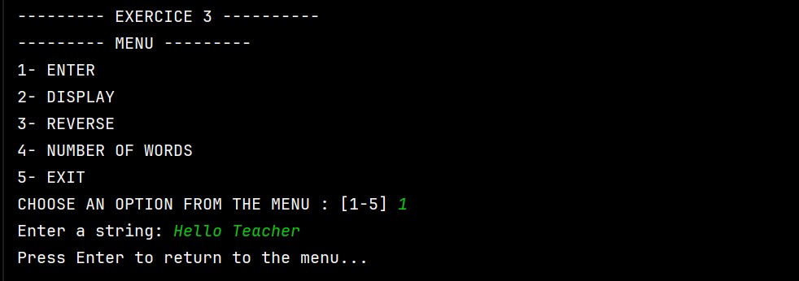
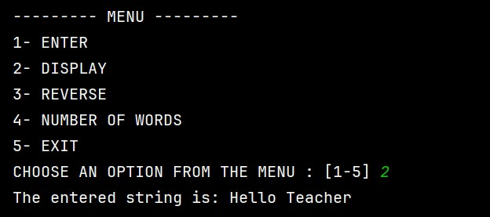
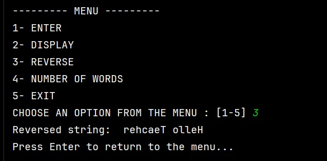
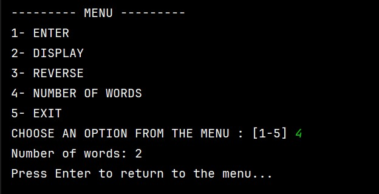
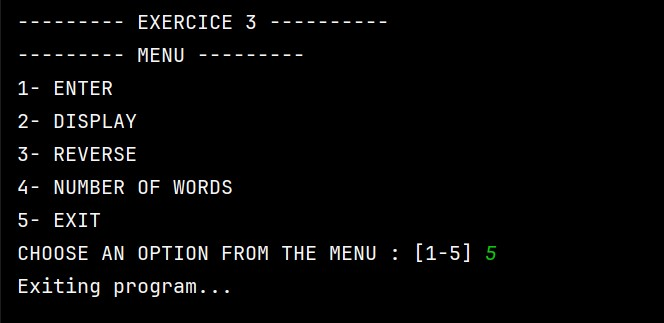

# TD1 Java

This repository contains all TD1 Java exercises.  
Each exercise includes a problem description, solution explanation, and execution screenshots.

---

## Exercise 1 – Grades Management
**Problem:**  
Store student grades in an array and allow sorting, average calculation, min/max display, and counting a specific grade.

**Solution:**  
- Used a `double[]` array to store grades.  
- Used `Arrays.sort()` to sort grades.  
- Calculated average, minimum, and maximum using loops.  
- Counted occurrences of a specific grade entered by the user.

**Execution screenshot:**  

---

## Exercise 2 – French Verb Conjugation
**Problem:**  
Read a French first-group verb (ending with *-er*) and display its conjugation in the present tense.

**Solution:**  
- Checked that the verb ends with `"er"`.  
- Extracted the verb root using `substring()`.  
- Handled special cases (`-ger`, `-cer`, `-eler`, `-eter`).  
- Printed conjugation for all persons.

**Execution screenshot:**  

---

## Exercise 3 – String Operations Menu
**Problem:**  
Menu-based program to enter a string, display it, reverse it, and count the number of words.

**Solution:**  
- Used a `while` loop for the menu.  
- Stored the string in a variable.  
- Used `StringBuilder` to reverse strings.  
- Used `trim()` and `split("\\s+")` to count words.  

**Execution screenshots (full program flow):**  

  
  
  
  

---

## Exercise 4 – Letter Occurrence Counter
**Problem:**  
Count occurrences of each letter in a string without distinguishing uppercase and lowercase letters.

**Solution:**  
- Converted the string to uppercase.  
- Used an `int[26]` array to store occurrences.  
- Iterated through the string, incrementing counts for letters A-Z.  
- Displayed only letters appearing at least once.

**Execution screenshot:**  
*(Add `ex4.jpg` here if you have it)*  

